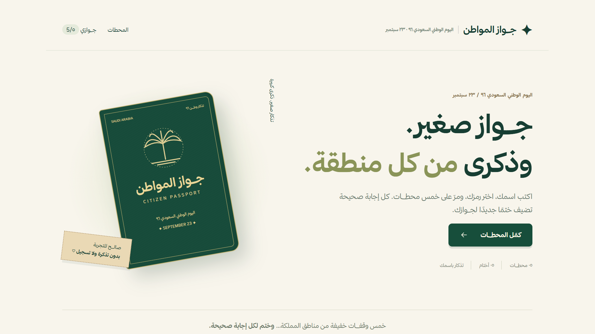
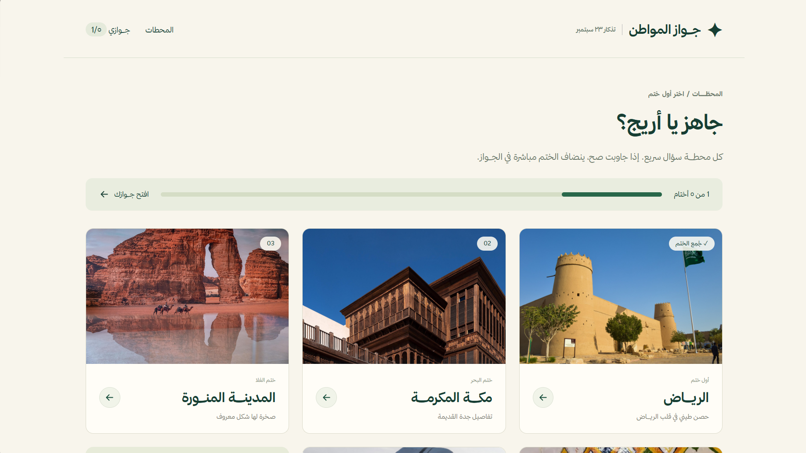
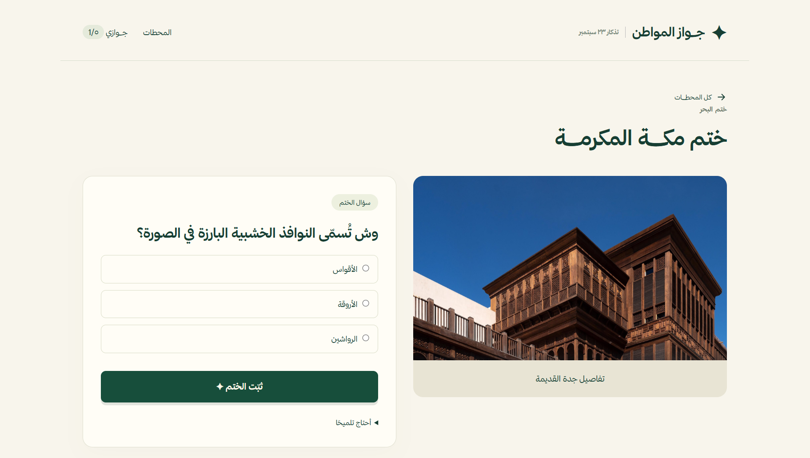
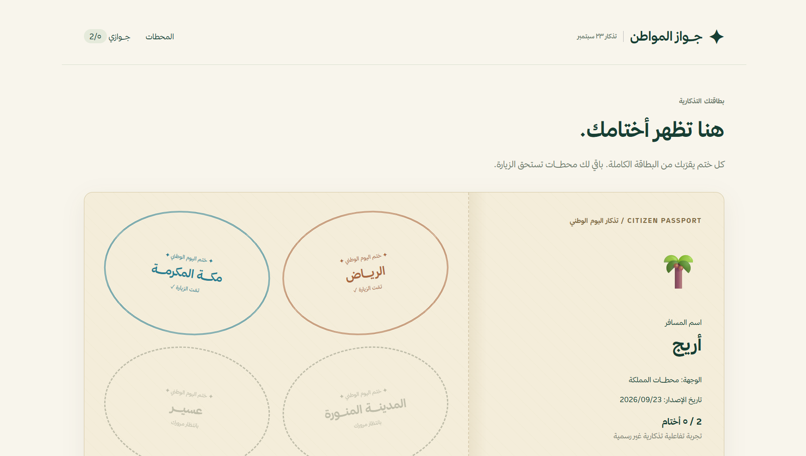
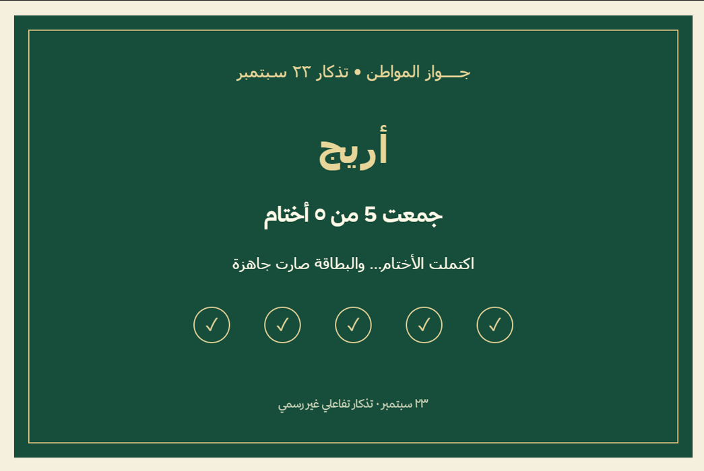

# جواز المواطن | Citizen Passport

<p align="center">
  <strong>تجربة رقمية تفاعلية لليوم الوطني السعودي ٩٦</strong>
</p>

<p align="center">
  Explore · Learn · Collect
</p>

<p align="center">
  
  
  
  
  
</p>

---

## 🌐 Live Experience

> سيتم إضافة رابط النسخة المنشورة هنا بعد اكتمال النشر على Render.

---

## ✦ عن المشروع

**جواز المواطن** هو مشروع ويب تفاعلي مبني باستخدام **Django**، تم تطويره كتجربة رقمية مرتبطة باليوم الوطني السعودي ٩٦.

بدلًا من تقديم محتوى المناسبة في صفحة تقليدية، يحوّل المشروع التجربة إلى **رحلة رقمية قصيرة عبر المملكة**.

يصدر المستخدم جوازه الخاص، ثم ينتقل بين خمس محطــــات مستوحاة من مناطق المملكة وثقافتها ومعالمها. في كل محطة يواجه سؤالًا بسيطًا، وعند الإجابة الصحيحة يحصل على **ختم رقمي** يضاف مباشرة إلى جوازه.

بعد جمع الأختام، يستطيع المستخدم إنشاء **بطاقة تذكارية شخصية بصيغة PNG** تحمل اسمه وإنجازه، ثم تحميلها أو مشاركتها.

> المشروع تجربة تذكارية مستقلة وغير رسمية، ولا يمثل أي جهة حكومية.

---

## 🎯 الرؤية

الفكرة الأساسية ليست مجرد موقع لليوم الوطني، بل نموذج يمكن تطويره إلى **منصة رحلات رقمية تفاعلية**.

يمكن استخدام نفس المفهوم في:

- الفعاليات الوطنية.
- السياحة.
- المتاحف.
- المعارض.
- الجامعات.
- التجارب التعليمية.
- المسارات الثقافية والتراثية.

الهدف هو تحويل المحتوى من تجربة مشاهدة إلى تجربة مشاركة:

```text
اكتشف
   ↓
تفاعل
   ↓
أجب
   ↓
اجمع
   ↓
أكمل الرحلة
   ↓
احتفظ بتذكار رقمي
```

---

# 🧭 تجربة المستخدم

## 01 — إصدار الجــــواز

تبدأ التجربة من الصفحة الرئيسية، حيث يتعرف المستخدم على فكرة المشروع ويصدر جوازه الرقمي باستخدام اسمه ورمز يختاره.



---

## 02 — استكشاف المحطــــات

بعد إصدار الجواز تظهر المحطات المتاحة، مع عرض مستوى التقدم وعدد الأختام التي تم جمعها.

يمكن للمستخدم زيارة المحطات بالترتيب الذي يفضله.



---

## 03 — تحدي المحطــــة

كل محطة تحتوي على محتوى بصري وسؤال مرتبط بأحد المعالم أو العناصر الثقافية السعودية.

يمكن للمستخدم اختيار الإجابة واستخدام تلميح عند الحاجة.



---

## 04 — جمع الأختــــام

عند الإجابة الصحيحة يتم تسجيل الزيارة وإضافة ختم المحطة إلى الجواز.

تُحفظ الأختام في قاعدة البيانات، ويمنع النظام تكرار الختم لنفس المحطة.



---

## 05 — البطاقة التذكارية

بعد إكمال الرحلة يمكن للمستخدم إنشاء بطاقة رقمية شخصية.

تُرسم البطاقة مباشرة داخل المتصفح باستخدام **JavaScript Canvas API**، ويمكن تحميلها بصيغة PNG أو مشاركتها من الجهاز.



---

## 📍 المحطــــات الحالية

| المنطقة | التجربة |
|---|---|
| الرياض | قصر المصمك |
| مكة المكرمة | الرواشين في جدة التاريخية |
| المدينة المنورة | جبل الفيل في العلا |
| عسير | فن القط العسيري |
| المنطقة الشرقية | مركز إثراء |

---

## ✨ أبرز الخصائص

- واجهة عربية كاملة تدعم `RTL`.
- تصميم Responsive للجوال والحاسوب.
- تجربة مستوحاة من الجواز والأختام.
- إصدار جواز رقمي باسم المستخدم.
- خمس محطــــات تفاعلية.
- أسئلة اختيار من متعدد.
- نظام تلميحات.
- تتبع تقدم المستخدم.
- حفظ الجواز والأختام في قاعدة البيانات.
- منع تكرار الأختام.
- استخدام Django Sessions بدون الحاجة إلى تسجيل حساب.
- إنشاء بطاقة تذكارية PNG داخل المتصفح.
- دعم Web Share API عند توفرها.
- إمكانية حذف الجواز والبدء من جديد.
- عدم طلب بيانات شخصية حساسة.

---

## ⚙️ Technical Highlights

### Django Sessions

يعتمد المشروع على **Django Sessions** لربط المستخدم بالجواز الخاص به دون الحاجة إلى نظام تسجيل حسابات تقليدي.

### Database Persistence

يتم حفظ بيانات الجواز والأختام في قاعدة البيانات، وليس فقط داخل المتصفح.

### Dynamic Templates

يتم استخدام Django Templates لعرض حالة المحطات والأختام والتقدم بشكل ديناميكي حسب كل مستخدم.

### Duplicate Stamp Prevention

يتحقق الـ Backend من عدم حصول المستخدم على ختم المحطة نفسها أكثر من مرة.

### Canvas-generated Card

تُنشأ البطاقة النهائية بالكامل داخل المتصفح باستخدام **Canvas API**، دون الحاجة إلى خدمة خارجية لتوليد الصور.

### Production-ready Configuration

تم تجهيز المشروع لبيئة Production باستخدام:

- PostgreSQL
- Gunicorn
- WhiteNoise
- Environment Variables
- Render

---

## 🛠️ Tech Stack

| Layer | Technologies |
|---|---|
| Backend | Python, Django |
| Frontend | HTML5, CSS3, JavaScript |
| Database | SQLite / PostgreSQL |
| Image Generation | JavaScript Canvas API |
| Sessions | Django Sessions |
| Static Files | WhiteNoise |
| Production Server | Gunicorn |
| Deployment | Render |
| Design | RTL, Responsive Design, Thmanyah Sans |

---

## 🏗️ Architecture

```text
                    ┌─────────────────┐
                    │     Browser     │
                    └────────┬────────┘
                             │
                             ▼
                    ┌─────────────────┐
                    │   Django URLs   │
                    └────────┬────────┘
                             │
                             ▼
                    ┌─────────────────┐
                    │      Views      │
                    └────────┬────────┘
                             │
                ┌────────────┴────────────┐
                ▼                         ▼
       ┌─────────────────┐       ┌─────────────────┐
       │ Django Templates│       │     Models      │
       └────────┬────────┘       └────────┬────────┘
                │                         │
                ▼                         ▼
       HTML / CSS / JavaScript       PostgreSQL

## 📂 Project Structure

```text
citizen-passport/
│
├── config/
│   ├── settings.py
│   ├── urls.py
│   └── wsgi.py
│
├── journey/
│   ├── models.py
│   ├── views.py
│   ├── urls.py
│   ├── data.py
│   └── tests.py
│
├── templates/
├── static/
│   ├── css/
│   ├── js/
│   ├── images/
│   └── fonts/
│
├── docs/
│   └── screenshots/
│
├── manage.py
├── requirements.txt
├── build.sh
└── README.md
```

---

## 🚀 Project Status

**Status: Active Development**

النسخة الحالية تمثل **MVP مكتمل الوظائف الأساسية** للمشروع، مع استمرار العمل على تحسين التجربة وتطوير الفكرة مستقبلًا.

من التطويرات المقترحة:

- إضافة جميع مناطق المملكة.
- إنشاء أكثر من مسار للرحلة.
- مسار للتراث والثقافة.
- مسار للسياحة.
- مسار للأكلات الشعبية.
- مسار للمعالم التاريخية.
- إضافة Achievements ونظام نقاط.
- إضافة Leaderboard.
- الحصول على الأختام باستخدام QR Codes في الفعاليات.
- إضافة أختام مرتبطة بالموقع الجغرافي.
- إدارة المحطات والمحتوى من Django Admin.
- دعم لغات متعددة.
- إضافة مشاركة اجتماعية أكثر تطورًا.
- تحويل المشروع إلى Progressive Web App.
- تطوير نسخة Mobile مستقبلًا.

---

## 🔐 Privacy by Design

تم تصميم التجربة بحيث لا تحتاج إلى:

- بريد إلكتروني.
- رقم جوال.
- كلمة مرور.
- حساب مستخدم.
- معلومات شخصية حساسة.

يتم استخدام الاسم والرمز المختار فقط لإنشاء التجربة، مع ربط الجواز بجلسة المتصفح.

---

## 💻 Local Development

### Windows

```powershell
py -m venv .venv
.\.venv\Scripts\python.exe -m pip install -r requirements.txt
.\.venv\Scripts\python.exe manage.py migrate
.\.venv\Scripts\python.exe manage.py runserver
```

ثم افتح:

```text
http://127.0.0.1:8000/
```

### macOS / Linux

```bash
python3 -m venv .venv
.venv/bin/python -m pip install -r requirements.txt
.venv/bin/python manage.py migrate
.venv/bin/python manage.py runserver
```

---

## 🧪 Tests

```bash
python manage.py test
```

---

## 🌐 Deployment

المشروع معدّ للنشر على **Render** باستخدام PostgreSQL وGunicorn وWhiteNoise.

```text
Build Command:
./build.sh

Start Command:
gunicorn config.wsgi:application
```

---

## 👩🏻‍💻 Developed by

**Areeg Thallab**

Software Engineering  
Backend & Web Development

---

<p align="center">
   <strong>جــــواز المواطن</strong>
  <br>
  رحلة رقمية صغيرة لاكتشاف جانب من وطن كبير.
</p>
